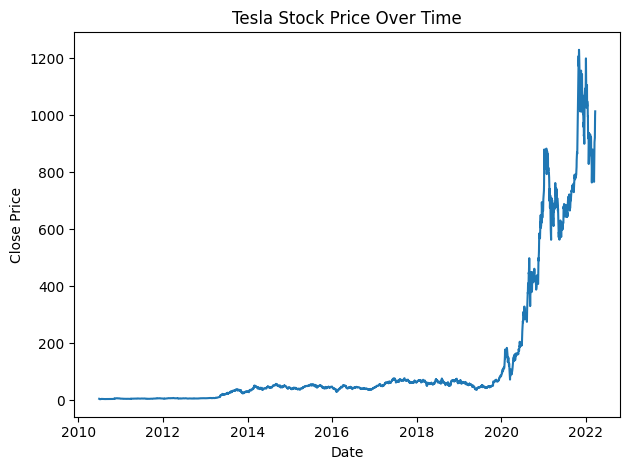
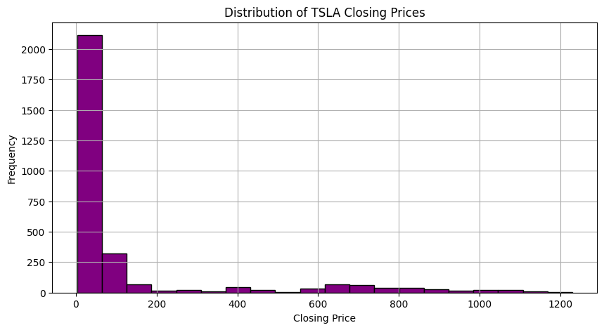
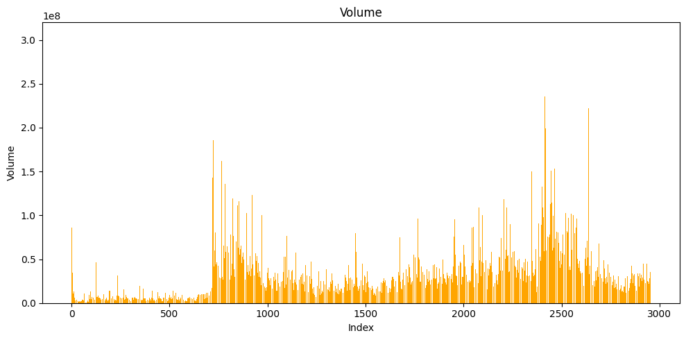
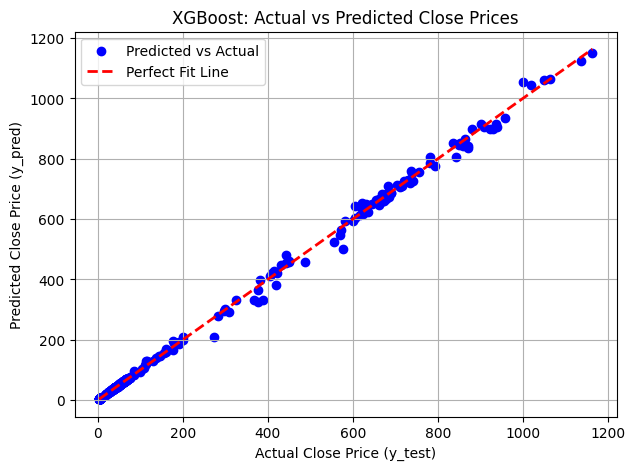
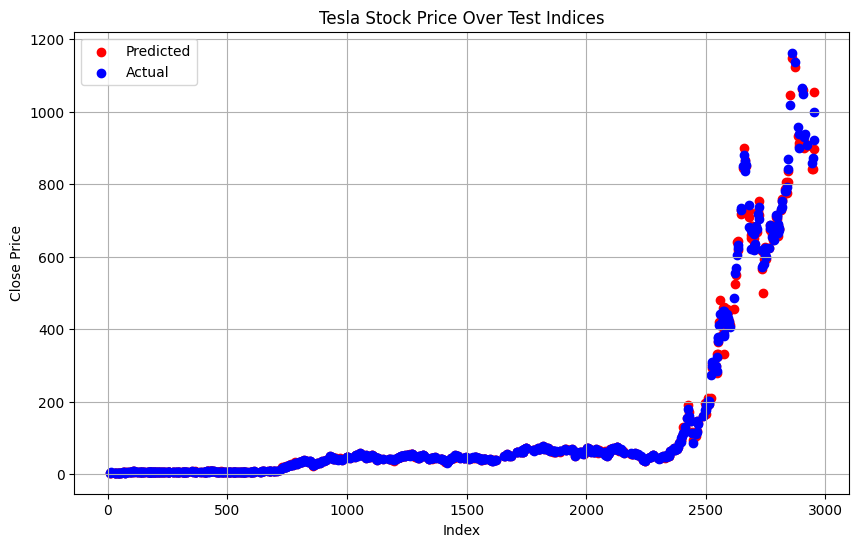

# Tesla (TSLA) Stock Price Prediction using XGBoost


---

### 📖 Table of Contents
1. [Overview](#-overview)
2. [Project Features](#-project-features)
3. [Dataset & Exploration](#-dataset--exploration)
4. [Methodology](#-methodology)
5. [Results and Evaluation](#-results-and-evaluation)
6. [Technologies Used](#-technologies-used)
7. [Setup and Usage](#-setup-and-usage)

---

## 📂 Overview

This project focuses on predicting the closing price of Tesla Inc. (TSLA) stock using historical market data and a powerful gradient boosting model. The goal is to build an accurate XGBoost Regressor that can forecast stock prices based on key daily indicators like opening price, daily high/low, and trading volume. This analysis demonstrates a practical application of machine learning in financial time-series forecasting.

---

## ✨ Project Features

* **Data Exploration & Visualization**: In-depth analysis of historical trends, trading volume, and price distributions.
* **Data Preprocessing**: Feature scaling using `StandardScaler` to normalize the data for the model.
* **Predictive Modeling**: Implementation of an XGBoost Regressor for high-accuracy predictions.
* **Model Evaluation**: Rigorous evaluation using standard regression metrics like R-squared, MSE, and MAE.
* **Result Visualization**: Clear and insightful plots comparing predicted vs. actual stock prices.

---

## 📈 Dataset & Exploration

The project utilizes the **TSLA.csv** dataset, containing daily stock data for Tesla from **June 29, 2010, to March 24, 2022**.

* **Target Variable**: `Close`
* **Features Used**: `Open`, `High`, `Low`, `Volume`

### Data Visualizations

**Tesla Stock Price Over Time**
*Shows the dramatic growth in Tesla's closing price, especially from 2020 onwards.*
<br>

<br><br>

**Distribution of Closing Prices**
*A histogram showing that most of Tesla's historical closing prices have been on the lower end, reflecting its exponential growth in later years.*
<br>

<br><br>

**Trading Volume Over Time**
*Displays the daily trading volume, with significant spikes corresponding to periods of high market activity.*
<br>

<br>

---

## 🛠️ Methodology

The prediction workflow consists of these steps:
1.  **Data Loading**: The `TSLA.csv` dataset is loaded into a Pandas DataFrame.
2.  **Feature Scaling**: The independent variables (`Open`, `High`, `Low`, `Volume`) are scaled using `StandardScaler`.
3.  **Train-Test Split**: The data is split into an 80% training set and a 20% testing set.
4.  **Model Training**: An **XGBoost Regressor** is trained on the scaled training data.

---

## 📊 Results and Evaluation

The model's performance on the test set was exceptional, indicating a highly accurate and reliable predictor.

| Metric | Value |
| --- | --- |
| **R² Score** | `0.9986` |
| **Mean Absolute Error (MAE)** | `$3.09` |
| **Mean Squared Error (MSE)** | `78.18` |

### Prediction Visualizations

**Actual vs. Predicted Close Prices (Fit Line)**
*This plot shows a nearly perfect linear relationship between the model's predictions and the actual stock prices.*
<br>

<br><br>

**Actual vs. Predicted Prices (Test Indices)**
*This plot shows how closely the model's predictions (in red) tracked the actual stock prices (in blue) over the test set's time indices.*
<br>

<br>

---

## 💻 Technologies Used

-   **Python**
-   **Pandas**
-   **Scikit-learn**
-   **XGBoost**
-   **Matplotlib** / **Seaborn**
-   **Jupyter Notebook**

---

## 🚀 Setup and Usage

To run this project locally, follow these steps:

1.  **Clone the repository:**
    ```bash
    git clone https://github.com/ShrikarBende/Stock-Market-Prediction---XGBoost.git
    ```
2.  **Navigate into the project directory:**
    ```bash
    cd Stock-Market-Prediction---XGBoost
    ```
3.  **Install the required dependencies:**
    ```bash
    pip install pandas xgboost scikit-learn matplotlib seaborn jupyter
    ```
4.  **Launch Jupyter Notebook:**
    ```bash
    jupyter notebook
    ```
5.  Open and run the `Stock_market_prediction_using_xgboost.ipynb` notebook to see the complete analysis.

---

   ## 📜 License

This project is open-source and available under the MIT License.
